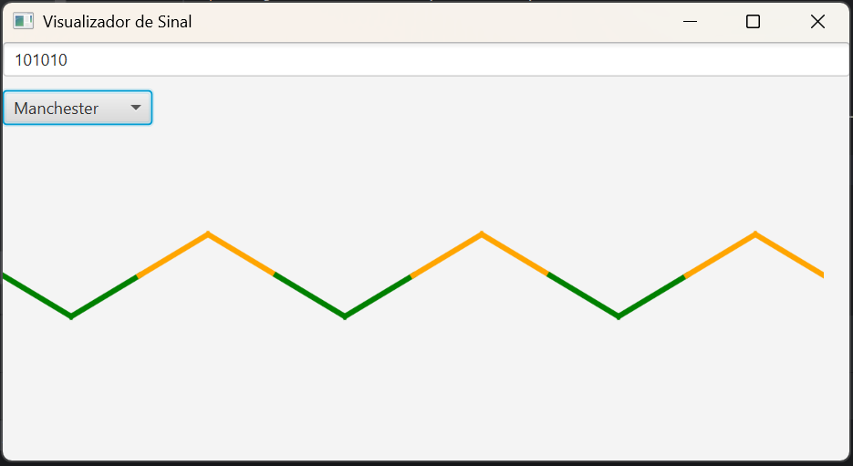

# Conversor de sinal com JavaFX

O **SignalConverterWithJavaFX** é uma aplicação que permite a conversão de sequências binárias entre diferentes formas de codificação utilizadas em sistemas de telecomunicações, com uma interface gráfica interativa desenvolvida em JavaFX.

O projeto oferece três métodos principais de codificação:

1. **NRZ (Non-Return-to-Zero)**:
   - O método NRZ representa os bits "1" e "0" como diferentes níveis de tensão. O "1" é representado por uma tensão positiva, enquanto o "0" é representado por uma tensão negativa. Não há transições no meio do bit, o que pode levar a problemas de sincronização em sequências longas de bits idênticos.

2. **RZ (Return-to-Zero)**:
   - No método RZ, o sinal de "1" é representado por um pulso que retorna ao nível "0" no meio do intervalo do bit. Já o "0" é representado por um sinal constante em "0". Essa codificação oferece uma transição mais frequente, facilitando a sincronização, mas pode exigir mais largura de banda.

3. **Manchester**:
   - O método Manchester combina dados e relógio em um único sinal. Cada bit é representado por uma transição no meio do intervalo: um "1" é representado por uma transição de baixo para cima, enquanto um "0" é representado por uma transição de cima para baixo. A principal vantagem deste método é a garantia de sincronização devido à presença de transições frequentes.

### Funcionamento:

O usuário insere uma sequência binária e escolhe o método de codificação desejado. A sequência é então convertida e exibida **graficamente**, usando JavaFX para mostrar os pulsos e transições de cada tipo de codificação ao longo do tempo. Isso permite visualizar como os sinais são representados e como as transições ocorrem para cada técnica de codificação.

Esse foco na visualização gráfica torna o projeto ideal para fins educacionais, permitindo aos usuários compreender de forma clara e interativa como diferentes métodos de codificação de sinais operam em sistemas de telecomunicações.

## Créditos

Desenvolvido por Mateus S.  
GitHub: [Matz-Turing](https://github.com/Matz-Turing)
